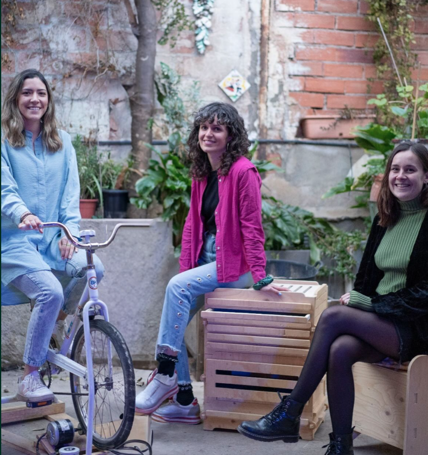

  

    
      <h1 class="yellow">
        Cuestionamos y rediseñamos las herramientas que utilizamos en nuestra vida cotidiana para depender menos de la alta tecnología.
      </h1>
    
    

      descubrir más
    

  

 
  

        <!--  -->
 

    <h1>Acerca de</h1>
    <h1>Acerca de</h1>
    <h1>Acerca de</h1>
    <h1>Acerca de</h1>
    <h1>Acerca de</h1>

    

        
        <h1>En la intersección entre el slow movement y low tech, somos un colectivo de diseñadores, makers y arquitectos que busca crear conciencia y promover modos de vida resilientes.</h1>
        

          descubrir más
        

    

